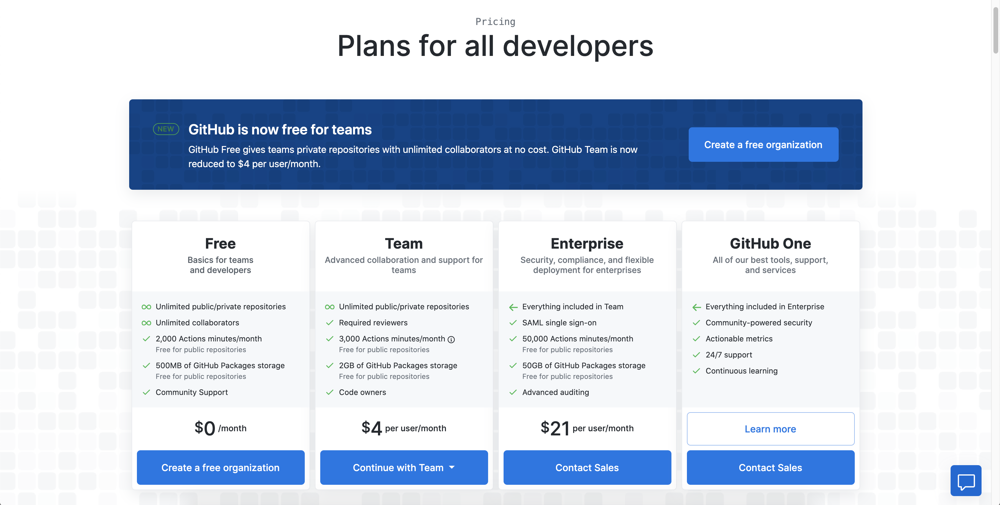

 
## Overview

Hello again, today I'm get you started using Github Actions. Github Actions are an absolutely amazing resource for helping developers perform mundane tasks automatically. If you have never setup CI/CD systems before and want to get started, there is no better way than with Github Actions. So lets get started!

## Github Actions Pricing

**TLDR; Its free for public repos and very cheap for private repos with a very generous free tier! (2000 Minute Free Tier)** 

So lets talk pricing first since you don't want to read a tutorial about some great product that you can't afford, luckily for you Github Actions Pricing is very affordable and by affordable I mean basically free for most users (I personally have payed a dime) and very affordable for larger teams and organizations, but don't take my word for it go checkout their pricing page: [Github Actions Pricing Page](https://github.com/pricing).

## Getting Started

For starters I'm going to assume you have a repo preferably a Javascript repo that you want to follow along with in this Github Actions Tutorial. 

Awesome first things first we need to setup 