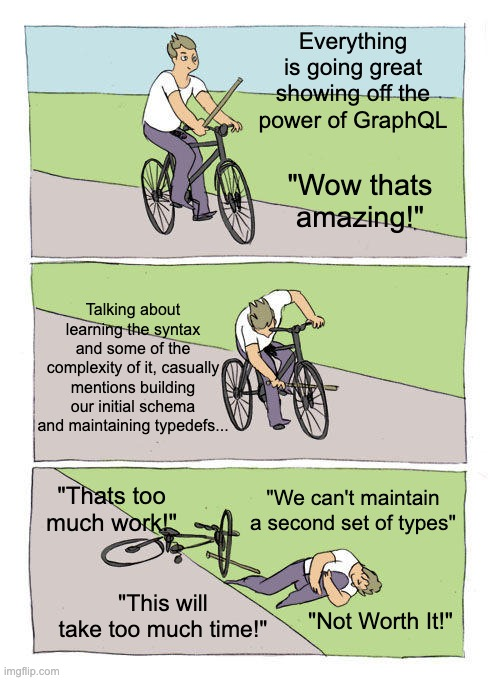

## Introduction

The biggest pain point of adopting GraphQL for any team (big or small) is creating your initial schema and maintaining it afterwards, period, end of story. Lets just face it, every GraphQL enthusiast has faced the same problem when explaining how amazing GraphQL is to their team for the first time and having it go like this:



## Code First vs Schema First

The biggest difference between a RESTful API & GraphQL is that GQL requires a Schema to work, much like a SQL database. Just that fact alone can be cause GraphQL to appear fairly daunting to setup & maintain. And with a schema first approach I would agree, especially when you are looking to migrate a fairly developed project, its going to take days, if not longer, to create a schema that matches your current REST system, but if you are already using Typescript (which I hope you are 😉) you might have the thought 🤔

**"Can I use my Typescript types as my GQL Schema?".** 

Unfortunately, the answer is "No" or at least not directly (foreshadowing). There are methods for using codegen to generate Typescript types from a GQL Schema, but that still means you have to write & maintain the Schema first. However, there is another approach which is to write code to generate a schema for you programmatically.

## A better way - Code First

Writing out a whole schema often feels like a waste of time, because you often already have Typescript types or entities/models in your codebase that look similar to your Schema. 

### Example Schema

Lets say your app is a todo app and you will need a final schema that looks like this:

```graphql
## src/schema/typedefs.gql
type User {
    email: String!
    todos: [Todo!]!
}

type Todo {
    text: String!
    isDone: Boolean!
    owner: User!
}
```


### Entity/Models

In Code first approach the goal is to generate the above example schema 👆 from the model/entity files you already probably have in your codebase that probably look like this:

```typescript
// src/entity/User.entity.ts
@Entity()
export class User {
    @Column()
    email: string

    @OneToMany()
    todos: Todo[]
}

// src/entity/Todo.entity.ts
@Entity()
export class Todo {
    @Column()
    text: string

    @Column()
    isDone: string

    @ManyToOne()
    owner: User
}
```

- The ```@Column()``` decorator creates a column in the database table
- The ```@ManyToOne()``` & ```@OneToMany()``` decorators create relationships between the tables
  
*These decorators are based off of [TypeORM](https://typeorm.io/#/)*

### Solution: TypeGraphQL 🚀

For you to generate your schema from your model/entity files your going to need [TypeGraphQL](https://typegraphql.com). TypeGraphQL has quite a few tools which are useful and worth looking into, but the main we are going to focus on is that it gives you access to a couple new decorators to add to your models that will allow you to generate your schema from your models 👀. To continue with our example above our new entity files are going to look like this:

```typescript
// src/entity/User.entity.ts
@Entity()
@ObjectType()
export class User {
    @Column()
    @Field()
    email: string

    @OneToMany()
    @Field(() => Todo)
    todos: Todo[]
}

// src/entity/Todo.entity.ts
@Entity()
@ObjectType()
export class Todo {
    @Column()
    @Field()
    text: string

    @Column()
    @Field()
    isDone: string

    @ManyToOne()
    @Field(() => [User])
    owner: User
}
```

As you can see we added ```@Field()``` & ```@ObjectType()``` decorators to our models, the ```@ObjectType()``` decorators tells TypeGraphQL that the class should be a ```type``` in your schema, and the ```@Field``` is for making properties of the class turn into properties of the type inside your GQL Schema. All and all adding a couple decorators was all it took to stop you and your team from maintaining separate Typescript & GraphQL types. However, the real power of TypeGraphQL is that now your GQL types are available in code at compile time, which leads to all sorts of cool codegen possibilities.

## Conclusion

This was a very brief intro into Code First GraphQL using [TypeGraphQL](https://typegraphql.com), but its just the tip of the iceberg, and in future blog posts I'm going to dive deeper into how you can utilize this to generate not only your model Schema, but also your CRUD resolvers and their Schemas using TypeGraphQL. Until then, let me know what you think in the comments and also feel free to ask me any clarifying questions.


